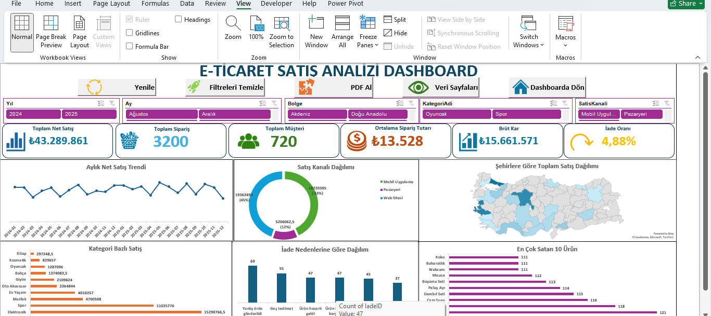

# 📊 Turkish E-Commerce Sales Analysis Project

This project is an end-to-end Turkish e-commerce sales analysis project built with **Excel** and **SQL Server**, and designed to be expanded with **Power BI** and **Python/Pandas** analysis.

The project focuses on transforming raw e-commerce sales data into clean, structured, and business-ready insights through dashboard reporting, relational data modeling, SQL-based data cleaning, and KPI analysis.

---

## 🚀 Project Overview

In this project, I worked on a Turkish e-commerce sales dataset and built a complete business analysis workflow.

The project currently includes:

- Interactive Excel sales dashboard
- SQL Server data import and quality checks
- Relational database modeling with Primary Key and Foreign Key relationships
- SQL-based data cleaning using functions and views
- Main SQL analysis view for business reporting
- KPI and business analysis queries for sales, products, customers, regions, shipping, and returns

The project structure is prepared to include:

- Power BI dashboard development
- Python/Pandas data analysis

---

## 🧰 Tools & Technologies

- Microsoft Excel
- SQL Server
- SQL Server Management Studio
- SQL Views
- SQL Functions
- Relational Database Design
- Data Cleaning
- KPI Analysis
- Business Intelligence
- Dashboard Reporting

Planned / Next:

- Power BI
- Python
- Pandas

---

## 📁 Project Structure

```text
turkish-e-commerce-sales-analysis/
│
├── excel/
│   ├── ecommerce_dashboard.xlsm
│   └── screenshots/
│       └── excel-dashboard.png
│
├── sql/
│   ├── 01_data_import_and_quality_checks.sql
│   ├── 02_primary_foreign_keys.sql
│   ├── 03_cleaning_function.sql
│   ├── 04_clean_views.sql
│   ├── 05_analysis_view.sql
│   ├── 06_kpi_and_analysis_queries.sql
│   └── analysis_queries_video.mp4
│
├── powerbi/
│   ├── dashboard.pbix
│   └── screenshots/
│       └── powerbi-dashboard.png
│
├── python/
│   ├── ecommerce_analysis.ipynb
│   └── outputs/
│
└── README.md
```

---

## 📊 Excel Dashboard

The Excel dashboard provides an interactive reporting layer for analyzing e-commerce sales performance.

It includes:

- Sales KPIs
- Profit analysis
- Product and category performance
- Customer insights
- Regional analysis
- Sales channel analysis
- Payment method analysis

Dashboard preview:



---

## 🗄️ SQL Server Analysis

The SQL Server part of the project creates a structured and reusable analysis layer from the raw e-commerce dataset.

The SQL workflow includes:

- Importing CSV files into SQL Server
- Checking imported tables, row counts, columns, and data types
- Validating duplicate ID values
- Checking relationship quality between tables
- Creating Primary Key and Foreign Key constraints
- Cleaning Turkish currency and date formats
- Creating clean SQL views
- Building a main analysis view
- Writing KPI and business analysis queries

---

## 🔍 SQL Files

### `01_data_import_and_quality_checks.sql`

Includes import validation and data quality checks after transferring CSV files into SQL Server.

This file checks:

- Imported tables
- Row counts
- Column names and data types
- Sample records
- Duplicate ID values
- Relationship quality between tables
- Raw Turkish currency and date formats

---

### `02_primary_foreign_keys.sql`

Creates the relational database model by defining Primary Key and Foreign Key constraints.

Main relationships include:

- Customers → Cities
- Orders → Customers
- Order Details → Orders
- Order Details → Products
- Products → Categories
- Shipping → Orders
- Returns → Order Details

---

### `03_cleaning_function.sql`

Creates a reusable SQL function for cleaning Turkish currency formatted text values and converting them into numeric `DECIMAL` values.

Example conversions:

```text
₺14.700  → 14700.00
149,90   → 149.90
TL 2.500 → 2500.00
₺-       → NULL
```

---

### `04_clean_views.sql`

Creates clean SQL views for analysis-ready data.

Clean views include:

- `vw_SiparisDetaylari_Clean`
- `vw_Urunler_Clean`
- `vw_Takvim_Clean`
- `vw_Kargo_Clean`

These views convert raw text-based currency, cost, profit, discount, and date fields into usable data types.

---

### `05_analysis_view.sql`

Creates the main analysis view:

```sql
dbo.vw_Eticaret_SatisAnalizi
```

This view combines the key business tables into one reusable analysis layer:

- Sales details
- Orders
- Customers
- Cities and regions
- Products
- Categories
- Calendar
- Shipping
- Returns

This structure makes KPI and business analysis queries cleaner, easier to maintain, and more reusable.

---

### `06_kpi_and_analysis_queries.sql`

Includes KPI and business analysis queries based on the main analysis view.

The analysis includes:

- General KPI analysis
- Category performance
- Top-selling products
- Brand performance
- Monthly sales trend
- Customer segment analysis
- Gender-based customer analysis
- Age group analysis
- City and region analysis
- Sales channel analysis
- Payment method analysis
- Shipping performance
- Return reason analysis
- Category-based return rate
- Most profitable products

---

## 📈 Key Business Metrics

The project analyzes business metrics such as:

- Total orders
- Total customers
- Total products sold
- Total sales
- Total cost
- Gross profit
- Gross profit margin
- Total discount
- Return count
- Return rate
- Average order value
- Customer-based sales performance

---

## 📊 Power BI Dashboard

The Power BI part of the project will provide an interactive business intelligence dashboard based on the cleaned and modeled dataset.

It will focus on:

- KPI cards
- Sales trends
- Product and category analysis
- Customer and regional insights
- Shipping and return analysis

Power BI dashboard file:

```text
powerbi/dashboard.pbix
```

---

## 🐍 Python / Pandas Analysis

The Python/Pandas part of the project will focus on data exploration, cleaning, grouping, aggregation, and business analysis.

It will include:

- Reading and inspecting the dataset
- Data cleaning and preparation
- Grouped analysis with Pandas
- KPI calculations
- Sales and profitability analysis
- Exporting analysis outputs

Python analysis file:

```text
python/ecommerce_analysis.ipynb
```

---

## 🧠 What This Project Demonstrates

This project demonstrates the ability to:

- Build business dashboards in Excel
- Import and validate data in SQL Server
- Design relational database relationships
- Use Primary Key and Foreign Key constraints
- Clean real-world formatted data with SQL
- Create reusable SQL views and functions
- Build an analysis-ready data layer
- Write KPI and business analysis queries
- Structure a data analysis project for portfolio presentation

---

## 🎯 Purpose

The purpose of this project is to analyze Turkish e-commerce sales data through a practical business intelligence workflow.

The project focuses on:

- Sales performance analysis
- Profitability analysis
- Product and category performance
- Customer segmentation
- Regional analysis
- Shipping and return analysis
- Dashboard-based reporting

---

## 👨‍💻 About Me

I build data analysis and reporting projects using Excel, SQL Server, Power BI, and Python/Pandas.

My work focuses on transforming raw data into clean, structured, and business-ready insights through data cleaning, relational modeling, KPI analysis, and dashboard reporting.

📎 LinkedIn:  
https://www.linkedin.com/in/emre-erol-642bb5293/
